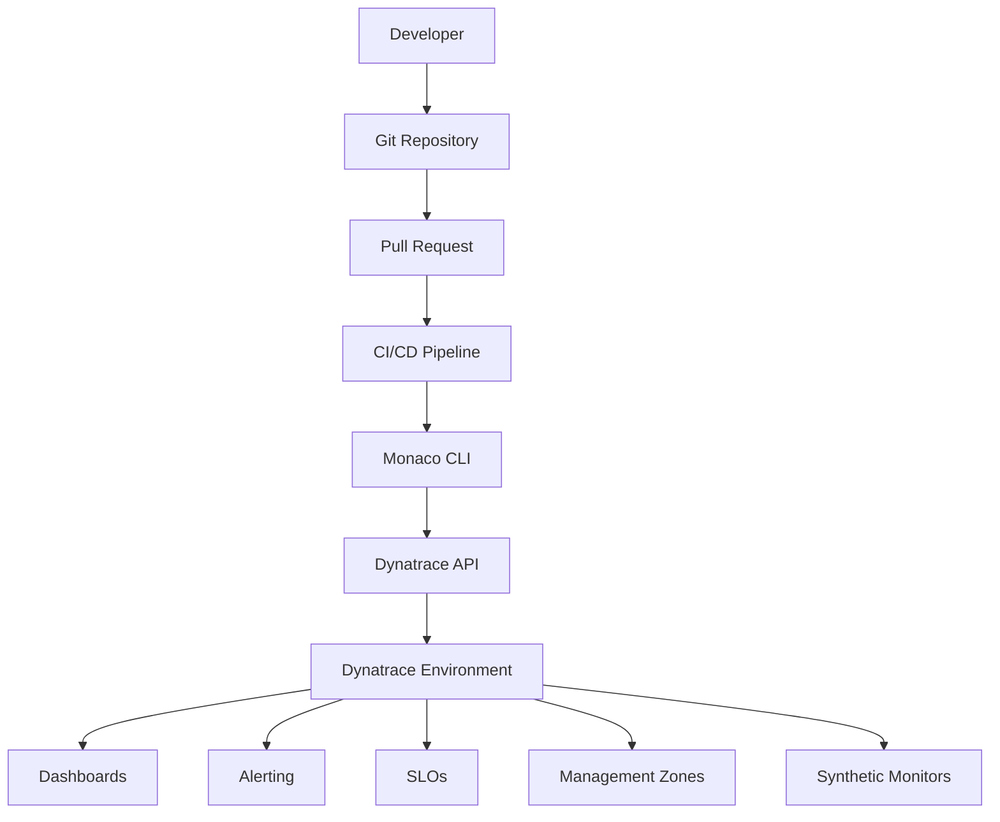
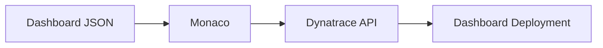
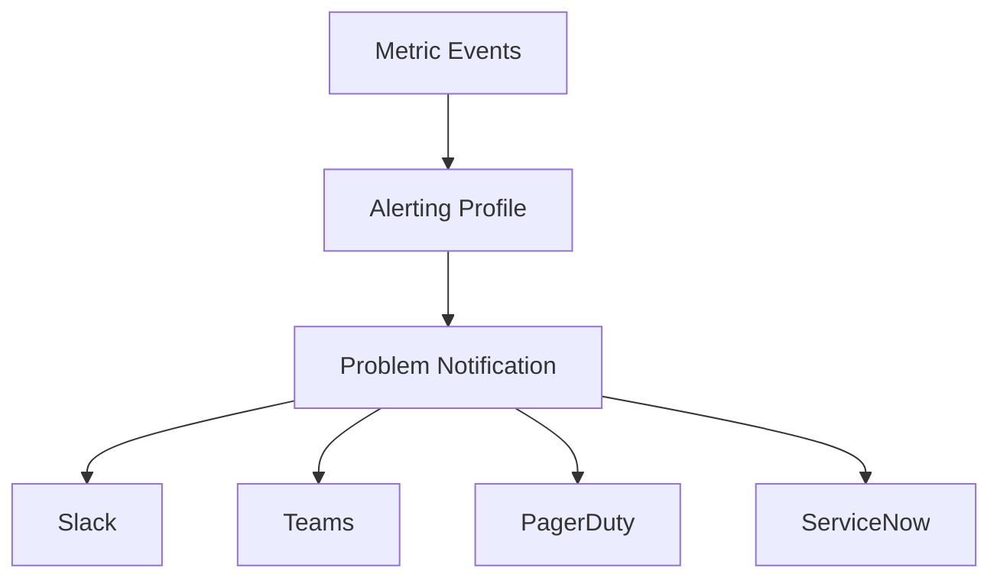
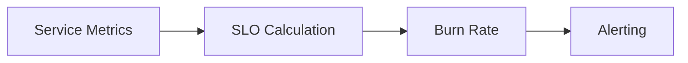
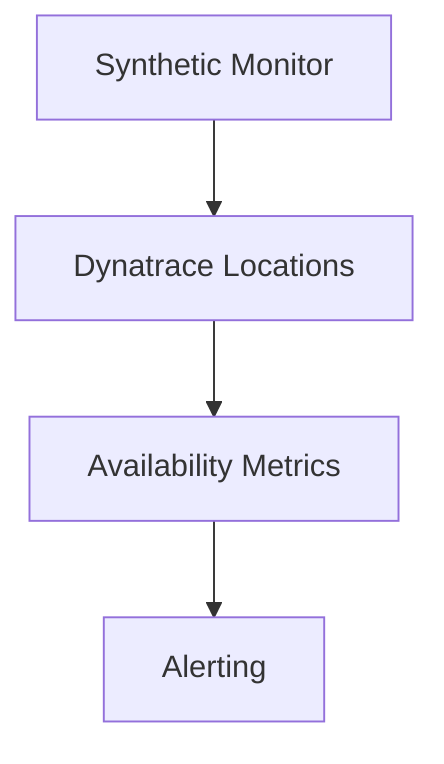
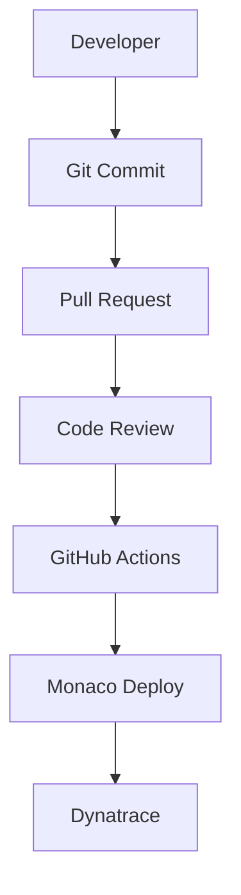
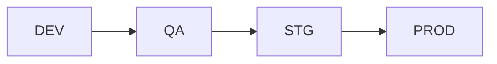
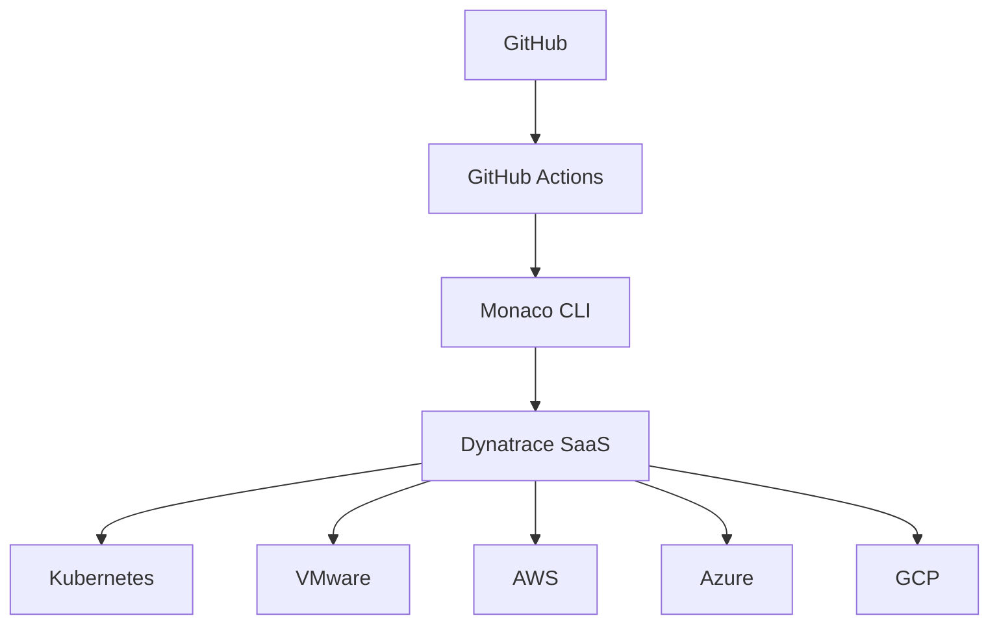
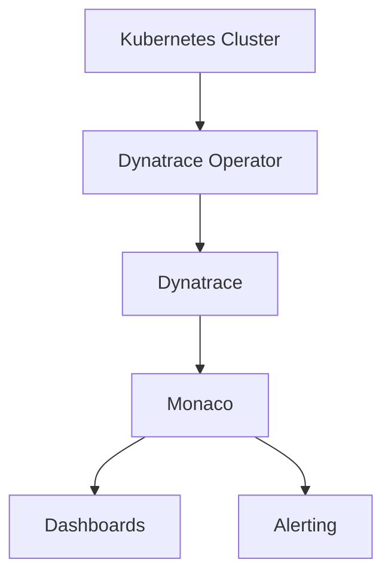
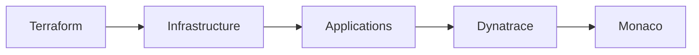

# Dynatrace Monaco (Monitoring as Code) — Complete Enterprise Manual

## Author

David Salazar

---

# Table of Contents

1. Introduction to Monaco
2. What is Monitoring as Code?
3. Monaco Architecture
4. Enterprise Use Cases
5. Monaco Installation
6. Professional Project Structure
7. Understanding manifest.yaml
8. Environment Management
9. Secure Token Management
10. Deploying Configurations
11. Downloading Existing Configurations
12. Dashboards as Code
13. Alerting as Code
14. Management Zones as Code
15. Naming Rules as Code
16. SLOs as Code
17. Synthetic Monitoring as Code
18. Settings 2.0
19. GitHub Integration
20. GitOps with Monaco
21. CI/CD with GitHub Actions
22. Multi-Environment Strategy
23. Dynatrace SaaS vs Managed
24. Troubleshooting
25. Enterprise Best Practices
26. Recommended Architectures
27. Security
28. Real-World Examples
29. Kubernetes Integration
30. Terraform Integration
31. Ansible Integration
32. Learning Roadmap
33. Official Resources

---

# 1. Introduction to Monaco

Monaco is the official Dynatrace CLI used to implement:

* Monitoring as Code
* Observability as Code
* Configuration as Code

It allows teams to manage:

* Dashboards
* Alerting profiles
* Management zones
* Naming rules
* SLOs
* Synthetic monitors
* Settings 2.0
* Extensions
* Grail configurations
* OpenPipeline
* Workflows
* Kubernetes monitoring
* Custom metrics

using:

* YAML
* JSON
* Git
* CI/CD
* Automated pipelines

---

# 2. What is Monitoring as Code?

Monitoring as Code is the observability equivalent of Infrastructure as Code.

Instead of configuring monitoring manually through the UI:

* everything is defined as code
* configurations are versioned in Git
* changes are reviewed through Pull Requests
* deployments are automated

## Benefits

* Reproducibility
* Version control
* Auditability
* Scalability
* CI/CD integration
* Disaster recovery
* Environment consistency
* Reduced human error

---

# 3. Monaco Architecture



---

# 4. Enterprise Use Cases

## Enterprise Observability Standardization

A company with:

* 200 microservices
* multiple Kubernetes clusters
* multiple Dynatrace tenants
* DEV / QA / PROD environments

can use Monaco to:

* deploy dashboards automatically
* synchronize alerting policies
* standardize naming conventions
* create reusable management zones
* deploy global synthetic monitoring

---

# 5. Monaco Installation

## Linux / WSL

```bash
curl -L https://github.com/Dynatrace/dynatrace-configuration-as-code/releases/latest/download/monaco-linux-amd64 -o monaco

chmod +x monaco

sudo mv monaco /usr/local/bin/
```

## Verify installation

```bash
monaco version
```

---

# 6. Professional Project Structure

## Recommended Enterprise Structure

```text
monaco/
├── manifests/
│   ├── dev.yaml
│   ├── qa.yaml
│   └── prod.yaml
│
├── projects/
│   ├── dashboards/
│   ├── alerting/
│   ├── slo/
│   ├── mz/
│   ├── synthetic/
│   ├── naming/
│   └── settings/
│
├── environments/
│   ├── dev.env
│   ├── qa.env
│   └── prod.env
│
├── templates/
├── scripts/
└── .github/
    └── workflows/
```

---

# 7. Understanding manifest.yaml

## Basic Example

```yaml
manifestVersion: "1.0"

projects:
  - name: dashboards
    path: projects/dashboards

environmentGroups:
  - name: dev
    environments:
      - name: dynatrace-dev
        url:
          type: environment
          value: DT_URL
        auth:
          token:
            name: DT_API_TOKEN
```

## Explanation

| Field             | Description        |
| ----------------- | ------------------ |
| manifestVersion   | Manifest version   |
| projects          | Projects to deploy |
| environmentGroups | Environment groups |
| environments      | Dynatrace tenants  |
| url               | Tenant URL         |
| auth              | Authentication     |
| token             | API token          |

---

# 8. Environment Management

## Environment Variables

```bash
export DT_URL="https://abc123.live.dynatrace.com"
export DT_API_TOKEN="dt0c01.xxxxx"
```

## Deployment

```bash
monaco deploy manifest.yaml
```

---

# 9. Secure Token Management

## Never do this

```yaml
value: "dt0c01.supersecret"
```

## Correct approach

```yaml
token:
  name: DT_API_TOKEN
```

## Recommended Secret Management

* GitHub Secrets
* Vault
* AWS Secrets Manager
* Azure Key Vault
* Hashicorp Vault

---

# 10. Deploying Configurations

## Full deployment

```bash
monaco deploy manifest.yaml
```

## Deploy specific environment

```bash
monaco deploy manifest.yaml -e dev
```

## Verbose deployment

```bash
monaco deploy manifest.yaml -v
```

---

# 11. Downloading Existing Configurations

## Download dashboards

```bash
monaco download dashboard
```

## Download configurations

```bash
monaco download
```

---

# 12. Dashboards as Code

## Architecture



## Example config.yaml

```yaml
configs:
  - id: app-dashboard
    config:
      name: app-dashboard.json
      type:
        settings:
          schema: builtin:dashboard
```

---

# 13. Alerting as Code

## Typical Components

* Alerting profiles
* Notification integrations
* Problem notifications
* Metric events
* Anomaly detection

## Architecture



---

# 14. Management Zones as Code

## Benefits

* Team isolation
* Logical multi-tenancy
* RBAC segmentation
* Team-specific dashboards
* Ownership boundaries

---

# 15. Naming Rules as Code

## Common Use Cases

* Host normalization
* Consistent naming
* Automatic tagging
* Ownership assignment

---

# 16. SLOs as Code

## SLO Architecture



## Common SLO Types

* Availability
* Latency
* Error rate
* Throughput

---

# 17. Synthetic Monitoring as Code

## Enterprise Use Cases

* Global availability validation
* Login validation
* API monitoring
* Customer journey monitoring

## Architecture



---

# 18. Settings 2.0

Dynatrace Settings API 2.0 enables management of modern Dynatrace configurations.

## Examples

* Anomaly detection
* Dashboards
* Naming rules
* Custom devices
* OpenPipeline
* Grail

---

# 19. GitHub Integration

## Recommended Flow



---

# 20. GitOps with Monaco

## Core Principles

* Git as source of truth
* Auditable changes
* Automated CI/CD
* Easy rollback
* Consistent environments

---

# 21. CI/CD with GitHub Actions

## Example Workflow

```yaml
name: Deploy Dynatrace Config

on:
  push:
    branches:
      - main

jobs:
  deploy:
    runs-on: ubuntu-latest

    steps:
      - name: Checkout
        uses: actions/checkout@v4

      - name: Install Monaco
        run: |
          curl -L https://github.com/Dynatrace/dynatrace-configuration-as-code/releases/latest/download/monaco-linux-amd64 -o monaco
          chmod +x monaco

      - name: Deploy
        env:
          DT_URL: ${{ secrets.DT_URL }}
          DT_API_TOKEN: ${{ secrets.DT_API_TOKEN }}
        run: |
          ./monaco deploy manifests/prod.yaml
```

---

# 22. Multi-Environment Strategy

## Enterprise Architecture



---

# 23. Dynatrace SaaS vs Managed

| Feature        | SaaS      | Managed     |
| -------------- | --------- | ----------- |
| Hosting        | Dynatrace | Customer    |
| Scalability    | Automatic | Manual      |
| Infrastructure | Cloud     | Self-hosted |
| API            | Same      | Same        |
| Monaco Support | Yes       | Yes         |

---

# 24. Troubleshooting

## Error 401

```text
Token Authentication failed
```

### Causes

* Invalid token
* Expired token
* Missing permissions
* Wrong tenant

---

## Error 404

```text
requested path unavailable
```

### Cause

Incorrect usage of:

```text
apps.dynatrace.com
```

Correct endpoint:

```text
live.dynatrace.com
```

---

# 25. Enterprise Best Practices

## Recommendations

* GitOps workflows
* Mandatory Pull Requests
* Automated CI/CD
* Standard naming conventions
* Domain-based management zones
* RBAC implementation
* Secure secret management
* Rollback strategies
* Promotion pipelines
* Isolated environments

---

# 26. Recommended Architectures

## Enterprise Topology



---

# 27. Security

## Security Best Practices

* Use secret managers
* Never hardcode tokens
* Least privilege RBAC
* Token rotation
* Git auditability
* Approval workflows

---

# 28. Real-World Examples

## Example 1 — Enterprise Kubernetes

Company environment:

* 20 clusters
* 500 microservices
* multiple engineering squads

Monaco usage:

* Standardized dashboards
* Standardized alerting
* Automated naming rules
* Squad-based management zones
* Global synthetic monitoring

---

## Example 2 — Multi-Tenant Observability

MSP environment:

* Multiple customers
* Multiple Dynatrace tenants

Use cases:

* Massive deployments
* Centralized CI/CD
* Standardized observability

---

# 29. Kubernetes Integration

## Architecture



---

# 30. Terraform Integration

## Hybrid Strategy

Terraform handles:

* Infrastructure
* Cloud resources
* Networking

Monaco handles:

* Observability
* Dashboards
* Alerting
* Settings

## Architecture



---

# 31. Ansible Integration

## Common Use Cases

Ansible:

* OneAgent installation
* ActiveGate configuration
* Extension deployment

Monaco:

* Dashboards
* Alerting
* Management zones

---

# 32. Learning Roadmap

## Level 1

* Monaco installation
* Basic manifests
* Basic deployment

## Level 2

* Dashboards as Code
* Alerting
* Management zones

## Level 3

* GitOps
* CI/CD
* Multi-environment strategy
* Automation

## Level 4

* Enterprise observability
* Multi-tenant strategy
* Platform engineering

---

# 33. Official Resources

## Documentation

[https://docs.dynatrace.com/docs/deliver/configuration-as-code/monaco](https://docs.dynatrace.com/docs/deliver/configuration-as-code/monaco)

## Official GitHub Repository

[https://github.com/Dynatrace/dynatrace-configuration-as-code](https://github.com/Dynatrace/dynatrace-configuration-as-code)

## Dynatrace API Explorer

[https://developer.dynatrace.com/](https://developer.dynatrace.com/)

---

# Conclusion

Monaco is a critical component of modern:

* Observability Engineering
* Site Reliability Engineering
* Platform Engineering
* GitOps
* Enterprise Monitoring

It transforms Dynatrace from a manually configured platform into a fully automated, reproducible, scalable observability platform.

In modern enterprise environments, Monaco is commonly integrated with:

* GitHub Actions
* Jenkins
* Azure DevOps
* Terraform
* Kubernetes
* Ansible
* Vault
* CI/CD pipelines

to build enterprise-grade automated observability platforms.
