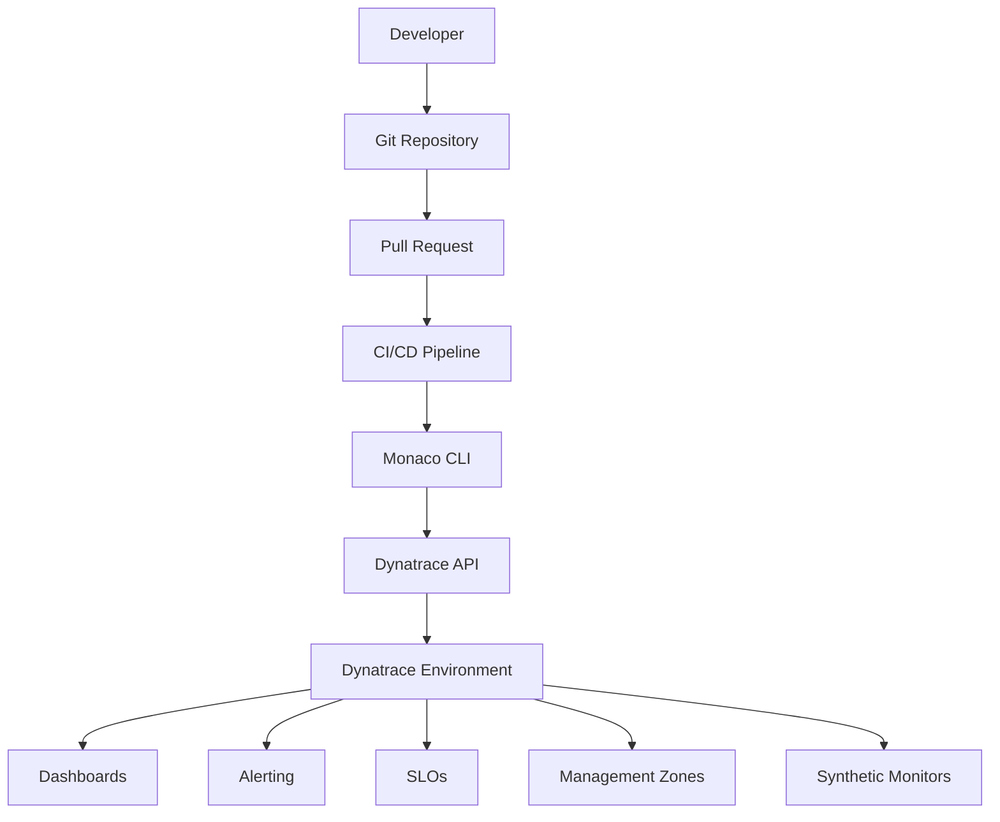
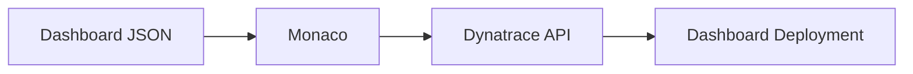
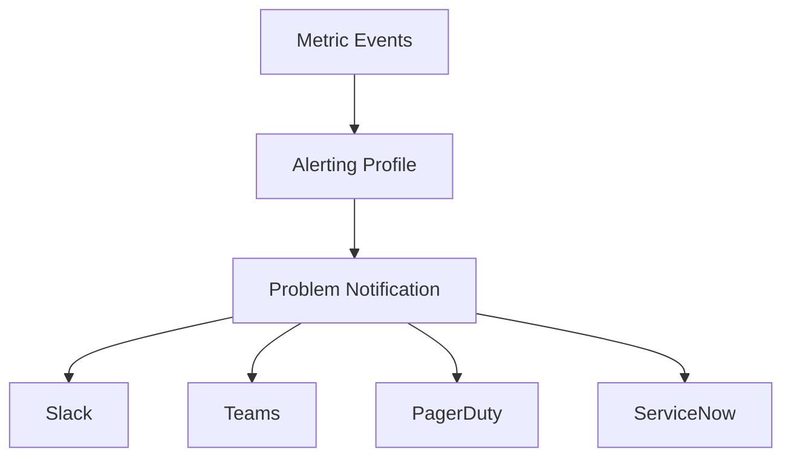
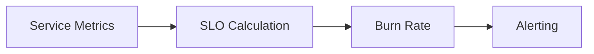
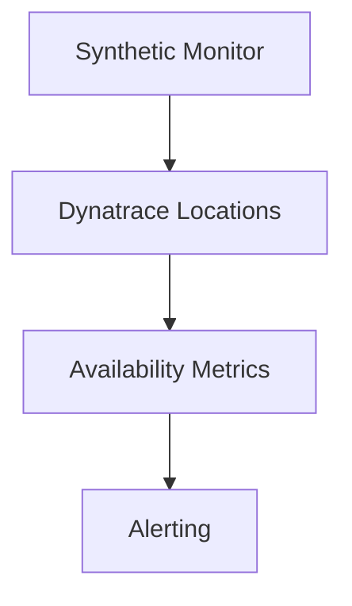
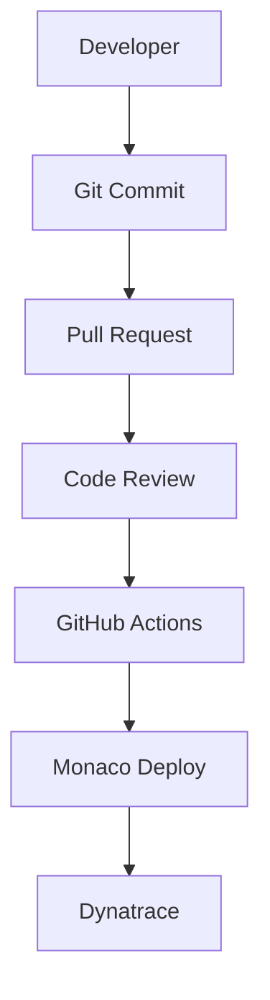
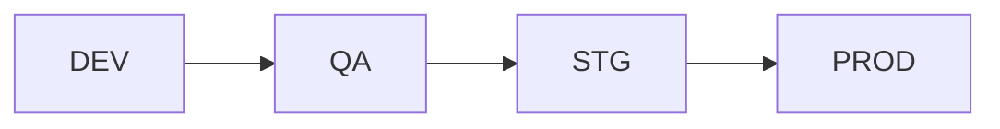
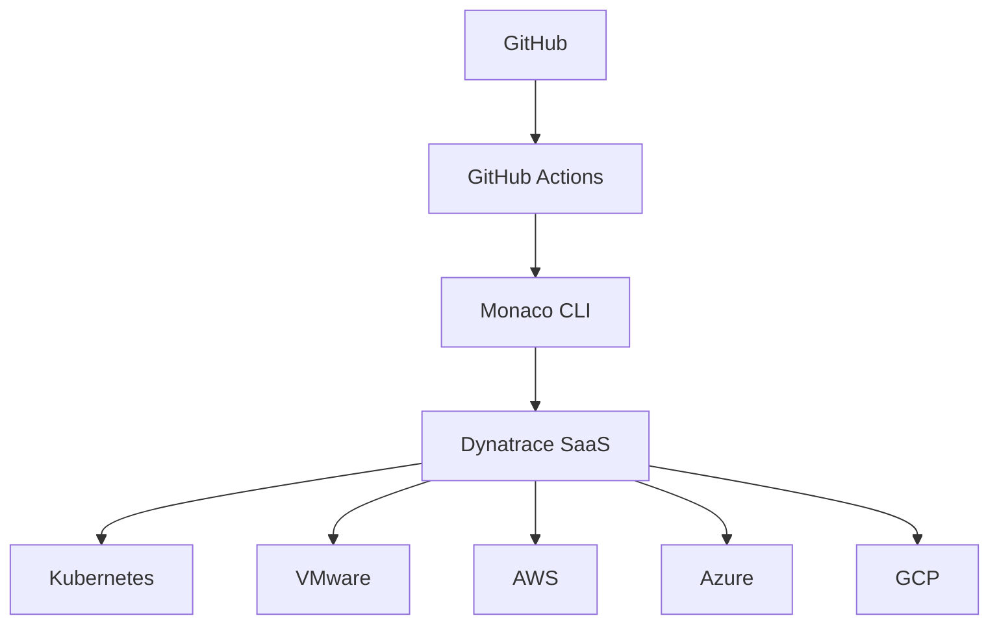
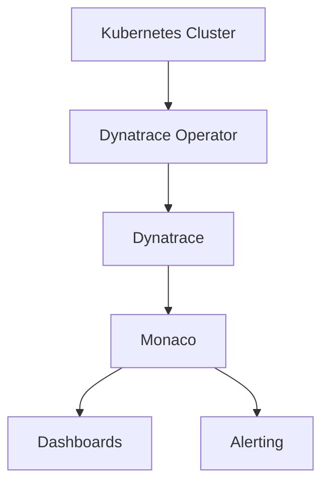
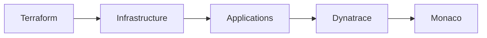

# Dynatrace Monaco (Monitoring as Code) — Manual Completo Enterprise

## Autor

David Salazar

---

# Tabla de Contenido

1. Introducción a Monaco
2. ¿Qué es Monitoring as Code?
3. Arquitectura de Monaco
4. Casos de uso enterprise
5. Instalación de Monaco
6. Estructura profesional de proyectos
7. Manifest.yaml explicado
8. Manejo de environments
9. Manejo seguro de tokens
10. Deploy de configuraciones
11. Download de configuraciones existentes
12. Dashboards as Code
13. Alerting as Code
14. Management Zones as Code
15. Naming Rules as Code
16. SLOs as Code
17. Synthetic Monitoring as Code
18. Settings 2.0
19. Integración con GitHub
20. GitOps con Monaco
21. CI/CD con GitHub Actions
22. Multi-environment strategy
23. Dynatrace SaaS vs Managed
24. Troubleshooting
25. Best Practices Enterprise
26. Arquitecturas recomendadas
27. Seguridad
28. Ejemplos reales
29. Integración con Kubernetes
30. Integración con Terraform
31. Integración con Ansible
32. Roadmap de aprendizaje
33. Recursos oficiales

---

# 1. Introducción a Monaco

Monaco es el CLI oficial de Dynatrace para implementar el concepto de:

* Monitoring as Code
* Observability as Code
* Configuration as Code

Permite administrar:

* Dashboards
* Alerting profiles
* Management zones
* Naming rules
* SLOs
* Synthetic monitors
* Settings 2.0
* Extensions
* Grail configurations
* OpenPipeline
* Workflows
* Kubernetes monitoring
* Custom metrics

Todo usando:

* YAML
* JSON
* Git
* CI/CD
* Pipelines automatizados

---

# 2. ¿Qué es Monitoring as Code?

Monitoring as Code es el equivalente de Infrastructure as Code pero aplicado a observabilidad.

En vez de configurar manualmente desde la UI:

* se define todo como código
* se versiona en Git
* se revisa con Pull Requests
* se despliega automáticamente

## Beneficios

* Reproducibilidad
* Versionado
* Auditoría
* Escalabilidad
* CI/CD
* Disaster recovery
* Consistencia entre ambientes
* Reducción de errores manuales

---

# 3. Arquitectura de Monaco



---

# 4. Casos de uso enterprise

## Enterprise observability standardization

Una empresa con:

* 200 microservicios
* múltiples clusters Kubernetes
* múltiples tenants Dynatrace
* DEV / QA / PROD

Puede usar Monaco para:

* desplegar dashboards automáticamente
* sincronizar alertas
* mantener naming rules consistentes
* crear management zones estandarizadas
* desplegar synthetic monitors globales

---

# 5. Instalación de Monaco

## Linux / WSL

```bash
curl -L https://github.com/Dynatrace/dynatrace-configuration-as-code/releases/latest/download/monaco-linux-amd64 -o monaco

chmod +x monaco

sudo mv monaco /usr/local/bin/
```

## Validar instalación

```bash
monaco version
```

---

# 6. Estructura profesional de proyectos

## Estructura enterprise recomendada

```text
monaco/
├── manifests/
│   ├── dev.yaml
│   ├── qa.yaml
│   └── prod.yaml
│
├── projects/
│   ├── dashboards/
│   ├── alerting/
│   ├── slo/
│   ├── mz/
│   ├── synthetic/
│   ├── naming/
│   └── settings/
│
├── environments/
│   ├── dev.env
│   ├── qa.env
│   └── prod.env
│
├── templates/
├── scripts/
└── .github/
    └── workflows/
```

---

# 7. Manifest.yaml explicado

## Ejemplo básico

```yaml
manifestVersion: "1.0"

projects:
  - name: dashboards
    path: projects/dashboards

environmentGroups:
  - name: dev
    environments:
      - name: dynatrace-dev
        url:
          type: environment
          value: DT_URL
        auth:
          token:
            name: DT_API_TOKEN
```

## Explicación

| Campo             | Descripción           |
| ----------------- | --------------------- |
| manifestVersion   | versión del manifest  |
| projects          | proyectos a desplegar |
| environmentGroups | grupos de ambientes   |
| environments      | tenants Dynatrace     |
| url               | URL del tenant        |
| auth              | autenticación         |
| token             | token API             |

---

# 8. Manejo de environments

## Variables de entorno

```bash
export DT_URL="https://abc123.live.dynatrace.com"
export DT_API_TOKEN="dt0c01.xxxxx"
```

## Deploy

```bash
monaco deploy manifest.yaml
```

---

# 9. Manejo seguro de tokens

## Nunca hacer esto

```yaml
value: "dt0c01.supersecreto"
```

## Correcto

```yaml
token:
  name: DT_API_TOKEN
```

## Buenas prácticas

* GitHub Secrets
* Vault
* AWS Secrets Manager
* Azure Key Vault
* Hashicorp Vault

---

# 10. Deploy de configuraciones

## Deploy completo

```bash
monaco deploy manifest.yaml
```

## Deploy de environment específico

```bash
monaco deploy manifest.yaml -e dev
```

## Deploy verbose

```bash
monaco deploy manifest.yaml -v
```

---

# 11. Download de configuraciones existentes

## Descargar dashboards

```bash
monaco download dashboard
```

## Descargar configuraciones

```bash
monaco download
```

---

# 12. Dashboards as Code

## Arquitectura



## Ejemplo config.yaml

```yaml
configs:
  - id: app-dashboard
    config:
      name: app-dashboard.json
      type:
        settings:
          schema: builtin:dashboard
```

---

# 13. Alerting as Code

## Componentes típicos

* Alerting profiles
* Notification integrations
* Problem notifications
* Metric events
* Anomaly detection

## Arquitectura



---

# 14. Management Zones as Code

## Beneficios

* separación por equipos
* multitenancy lógico
* RBAC
* dashboards segmentados
* ownership

## Ejemplo

```yaml
configs:
  - id: mz-payments
    config:
      name: mz-payments.json
      type:
        settings:
          schema: builtin:management-zones
```

---

# 15. Naming Rules as Code

## Casos de uso

* normalización de hosts
* naming consistente
* tagging automático
* ownership

---

# 16. SLOs as Code

## Arquitectura SLO



## Ejemplo

* availability
* latency
* error rate
* throughput

---

# 17. Synthetic Monitoring as Code

## Casos enterprise

* availability global
* login validation
* API validation
* customer journey monitoring

## Arquitectura



---

# 18. Settings 2.0

Dynatrace Settings API 2.0 permite manejar configuraciones modernas.

## Ejemplos

* anomaly detection
* dashboards
* naming
* custom devices
* OpenPipeline
* Grail

---

# 19. Integración con GitHub

## Flujo recomendado



---

# 20. GitOps con Monaco

## Principios

* Git como source of truth
* cambios auditables
* CI/CD automatizado
* rollback fácil
* ambientes consistentes

---

# 21. CI/CD con GitHub Actions

## Ejemplo workflow

```yaml
name: Deploy Dynatrace Config

on:
  push:
    branches:
      - main

jobs:
  deploy:
    runs-on: ubuntu-latest

    steps:
      - name: Checkout
        uses: actions/checkout@v4

      - name: Install Monaco
        run: |
          curl -L https://github.com/Dynatrace/dynatrace-configuration-as-code/releases/latest/download/monaco-linux-amd64 -o monaco
          chmod +x monaco

      - name: Deploy
        env:
          DT_URL: ${{ secrets.DT_URL }}
          DT_API_TOKEN: ${{ secrets.DT_API_TOKEN }}
        run: |
          ./monaco deploy manifests/prod.yaml
```

---

# 22. Multi-environment strategy

## Arquitectura enterprise



## Estrategia recomendada

* DEV → pruebas
* QA → validación
* STG → preproducción
* PROD → producción

---

# 23. Dynatrace SaaS vs Managed

| Feature         | SaaS       | Managed     |
| --------------- | ---------- | ----------- |
| Hosting         | Dynatrace  | Cliente     |
| Escalabilidad   | automática | manual      |
| Infraestructura | cloud      | self-hosted |
| API             | igual      | igual       |
| Monaco          | compatible | compatible  |

---

# 24. Troubleshooting

## Error 401

```text
Token Authentication failed
```

### Causas

* token inválido
* token expirado
* permisos insuficientes
* tenant incorrecto

---

## Error 404

```text
requested path unavailable
```

### Causa

Uso incorrecto de:

```text
apps.dynatrace.com
```

Debe usarse:

```text
live.dynatrace.com
```

---

# 25. Best Practices Enterprise

## Recomendaciones

* GitOps
* Pull Requests obligatorios
* CI/CD automatizado
* naming estándar
* management zones por dominio
* RBAC
* secretos seguros
* rollback strategy
* promotion pipeline
* environments separados

---

# 26. Arquitecturas recomendadas

## Enterprise topology



---

# 27. Seguridad

## Buenas prácticas

* usar secrets manager
* no hardcodear tokens
* RBAC mínimo necesario
* rotación de tokens
* auditoría Git
* approval workflows

---

# 28. Ejemplos reales

## Caso 1 — Kubernetes enterprise

Empresa:

* 20 clusters
* 500 microservicios
* múltiples squads

Uso de Monaco:

* dashboards estándar
* alertas estandarizadas
* naming rules automáticas
* management zones por squad
* synthetic monitors globales

---

## Caso 2 — Multi-tenant observability

Empresa MSP:

* múltiples clientes
* múltiples tenants Dynatrace

Uso:

* deployment masivo
* CI/CD centralizado
* observabilidad estándar

---

# 29. Integración con Kubernetes

## Arquitectura



---

# 30. Integración con Terraform

## Estrategia híbrida

Terraform:

* infraestructura
* cloud resources
* networking

Monaco:

* observabilidad
* dashboards
* alerting
* settings

## Arquitectura



---

# 31. Integración con Ansible

## Casos comunes

Ansible:

* instalación de OneAgent
* configuración de ActiveGate
* despliegue de extensiones

Monaco:

* dashboards
* alerting
* management zones

---

# 32. Roadmap de aprendizaje

## Nivel 1

* instalación Monaco
* manifests
* deploy básico

## Nivel 2

* dashboards as code
* alerting
* management zones

## Nivel 3

* GitOps
* CI/CD
* multi-environment
* automation

## Nivel 4

* enterprise observability
* multi-tenant strategy
* platform engineering

---

# 33. Recursos oficiales

## Documentación

[https://docs.dynatrace.com/docs/deliver/configuration-as-code/monaco](https://docs.dynatrace.com/docs/deliver/configuration-as-code/monaco)

## GitHub oficial

[https://github.com/Dynatrace/dynatrace-configuration-as-code](https://github.com/Dynatrace/dynatrace-configuration-as-code)

## Dynatrace API Explorer

[https://developer.dynatrace.com/](https://developer.dynatrace.com/)

---

# Conclusión

Monaco es una pieza clave dentro de una estrategia moderna de:

* Observability Engineering
* Site Reliability Engineering
* Platform Engineering
* GitOps
* Enterprise Monitoring

Permite transformar Dynatrace desde una herramienta manual hacia una plataforma completamente automatizada, reproducible y escalable.

En ambientes enterprise modernos, Monaco normalmente se integra con:

* GitHub Actions
* Jenkins
* Azure DevOps
* Terraform
* Kubernetes
* Ansible
* Vault
* CI/CD pipelines

para construir plataformas enterprise de observabilidad completamente automatizadas.
